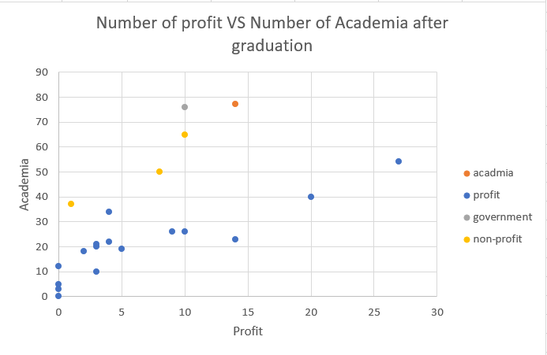
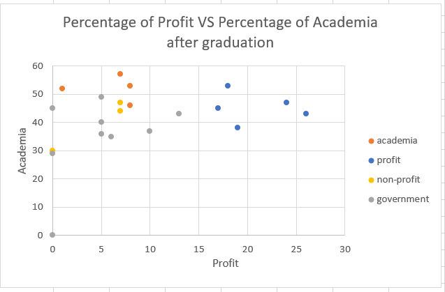
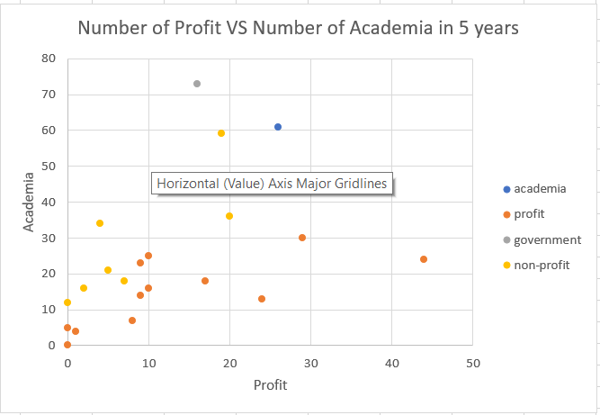
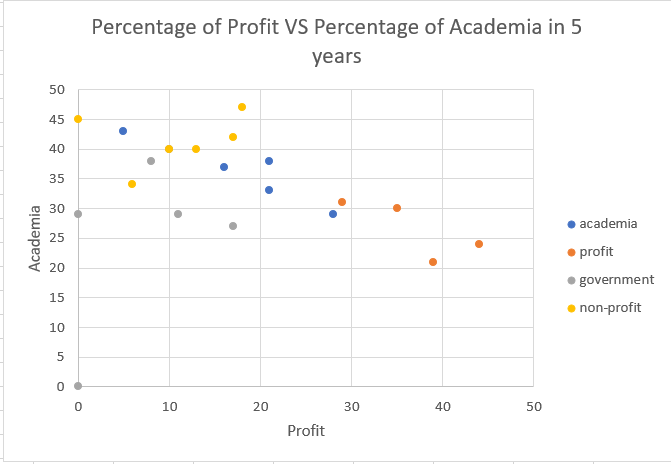

# NGLS Clustering project

# Summary 

- Next Generation Life Science Coalition consists career data of PhD and postdoc students from many universities. The main focus of this project is to use the open data on the website to understand what kind of industries would Hopkins students would pursue and how it would change within the 5 years after the graduation. Knowing this kind of information can help the career center at Johns Hopkins University provide more useful assistance and mentorship programs for the current students. 

# Step-by-Step Analysis

## Data Selection and Data Preprocess

- Collect the data from the [NGLS website](http://nglscoalition.org/coalition-data/#close) as a PDF file
- Parse the PDF with TABULA and get a CSV file that need to be normalized to the useful data
- Fix the format issues in the dataset (e.g. split the string "N %" using `Text to Column` function in Excel) 
- Take a peek at the value in the dataset and select the data for the career path for students right after the graduation and those who graduate for 5 years 
- The reason why I chose those data is that there are less students fall into the unknown category, which can help us understand the specific industry that students are interested. 

## File Specification

`tabula-Career-Outcome-ADA-Tables-Final.xlsx` contains all the table of our results 

`graduation` table shows the result of students' career path right after graduation 

`5 years` table shows the result of students' career path within 5 years of graduation 

## Data Visualization
- The following are clustering based on the numbers and percentage for students' career paths right after gradaution 
- 
- 

- The following are clustering based on the numbers and percentage for students' career paths right after 5 years of graduation

- 
- 

## Data Analysis

- As we can see from the graphs, the percentage for both graduation and 5 years tends to get a better result. The reason is that when we take the percentage, we normalize the number of students go into a specific industry by the total number of the students in that major, which to some extent can eliminate the discrepencies generted by a huge count of students.

- Working for government and profit groups seems to be two hot areas for PhD students who just graduate from school. However, as time passed, more students are switching back to academia and towards the non-profit organization. 

- One advice for career center is that they can try to build up more connections with government and profit companies for students because most of students are willing to get some practical experience in the industry. This trend follows the logic because many PhD students just finished a long time (around 5 years) of study and they are willing to get more hands-on experience in the industry. After they have certain experience in 5 years, they may switch back to academia or still continue doing projects in the industry. 

# Discussion and Limitation 
- The innate limitation of the data is that all the data are corresponded to biology or medical school related major. There is no data for other engineering students, which cannot help the career center deal with students with non-medical related majors. 
- There are some outliers like `Cell Biology` major, which only has one person in that field. This may generate some discrepencies for the entire clustering. So, maybe next time we can omit this data in order to make a better interpretation. 